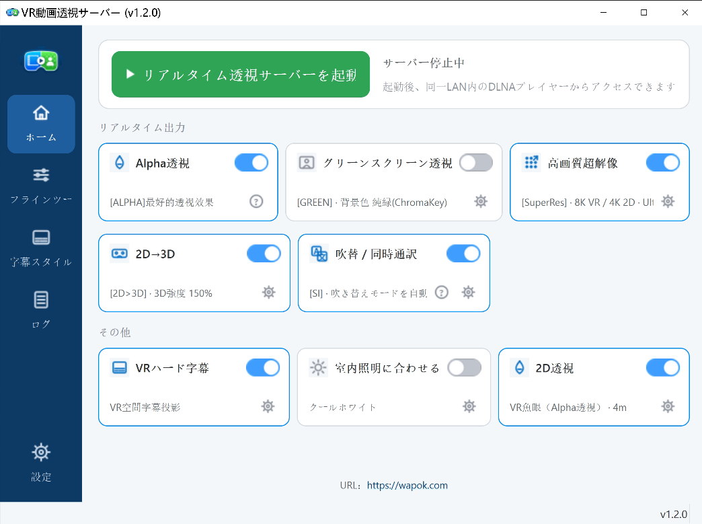

# VR Video Passthrough Server

日本語 | [English](README.md) | [中文](README.zh-CN.md)

公式サイト：[https://wapok.com](https://wapok.com)

VR Video Passthrough Server の目標は、すべてのVR動画をパススルー対応にし、複合現実（MR）を実現することです。


これは Windows を主な実行環境とする VR DLNA ローカルメディアサーバーで、多言語デスクトップUIと専用オフラインツールを備えています。DLNA/UPnP経由でローカル動画ライブラリを公開し、リアルタイムのグリーンスクリーン/Alphaパススルー、2D投影、2D→3D / VR、NVIDIA RTX Video Super Resolution、ハード字幕、ライトマッチング、同名 `.si.wav` サイドカーによる吹替/同時通訳再生に対応します。VR180 half-equirectangularソース向けに最適化されていますが、対応する平面2D動画も処理できます。

現在のデスクトップ版：**v1.2.0**。

## プロジェクトの起源

当初ただVR動画の透視ツールを作りたかった。  
誰かに「車輪の再発明だ」と言われたので、こう返しました。  
「あの何年も前の古い車輪はもう古すぎる。新しいものが必要だ」と。  
7日後、新しい車輪が誕生した。  
これこそ、AI時代の奇跡である。   

## 機能

- DLNA 検出と ContentDirectory ブラウズ
- GPU マッティングと HEVC 出力によるリアルタイムパススルーストリーミング
- パススルーストリームへのリアルタイム字幕埋め込み
- グリーンスクリーンモードと Alpha パススルーモード
- オフラインパススルー動画生成
- DA3 深度と GPU ステレオレンダリングによる、平面 2D 動画のリアルタイム/オフライン 2D→3D / VR 生成
- 内蔵の時間方向安定化と、オフライン 16:9 ジョブ向け NVDS ONNX 安定化を含む、任意の 2D→3D 深度安定化
- 対応する2D/VRソース向けリアルタイム/オフライン NVIDIA RTX Video Super Resolutionと、適応型 `8K VR / 4K 2D` 出力
- 2:1 SBS VRの左右眼GPU処理と、オフライン4K VR→8K VR用8192x4096 HEVC出力
- RTX VSRの低/中/高/Ultra品質と、オフ/自然/鮮明のSDR HDRルック
- 同名 `.si.wav` サイドカーによる吹替/同時通訳、`[SI]` DLNAエントリ、開始時間選択、チャンネルミックス、弱/標準/強ダッキング
- 10 分単位のグループ、分単位フォルダー、5 秒単位の再生ポイントで開始時刻を選べる DLNA Live 時間インデックス
- 複数のローカル動画ルートディレクトリに対応
- ナビゲーションレール、機能カード、オフラインツール、字幕スタイル、ログ、設定を備えたPySide6デスクトップUI
- 編集可能なDLNAサーバー名/HTTPポートと、中国語・英語・日本語UI
- 字幕プレビューと字幕スタイル設定
- 色温度、色合い、露出、コントラスト、ガンマ、彩度、プリセットを調整できるリアルタイムライトマッチング
- ハードウェアが維持できる範囲で 8K クラスのソース再生を目指す、VRAM を意識した積極的なパイプライン調整


|  |


## パススルー出力例

| Alpha Passthrough | グリーンスクリーン Passthrough |
| --- | --- |
|  |  |
|  |

## 動作要件

- Windows 10 / 11
- Python 3.12
- GPU処理用のNVIDIA GPU。目安としてRTX 20シリーズ以上を推奨し、RTX VSRにはNVIDIA RTX Video対応GPU/ドライバーが必要です。正確な型番はNVIDIA公式リストを確認してください: <https://developer.nvidia.com/cuda/gpus>。推奨VRAMは、リアルタイムサーバー、RVMオフライン生成、通常のDA3 2D→3Dで6 GB以上、MatAnyone2 / SAM3で約15 GB以上です。HD/Large DA3、NVDS、8K SuperResは高負荷のオフライン処理です。
- FFmpeg / FFprobe

性能上の注意：4K SBS VRをUltra品質で8K VRへ変換する処理は非常に高負荷です。RTX 5060 Tiでは約23～24処理FPSでした。ローエンドGPUでは目標品質またはグローバル設定の出力FPSを下げてください。NVENC P1はエンコード速度であり、NGX目標品質とは別です。

## クイックスタート

```bash
uv run python main.py
```

デスクトップ UI を起動:

```bash
uv run python -m ui.app
```

## ポートとファイアウォール

リアルタイムサーバーを起動すると、次のネットワークポートを使用します。

| 用途 | プロトコル / ポート | 説明 |
| --- | --- | --- |
| HTTP メディアサービス | TCP 8200 | DLNA デバイス記述、メディアカタログ、サムネイル、元動画、リアルタイム passthrough ストリームを提供します。`PT_HTTP_PORT` で変更できます。 |
| SSDP / UPnP 検出 | UDP 1900 | LAN 内の VR プレイヤーがこの DLNA サーバーを検出するために使用します。 |
| 起動ステータス | TCP 8299（ローカルホストのみ） | デスクトップ UI が GPU warmup / 起動状態を読むために使用します。デフォルトではローカル UI 用です。`PT_STARTUP_STATUS_PORT` で変更できます。 |

初回起動時、アプリケーションは次の Windows ファイアウォール受信規則を自動追加しようとします。

- `PTServer HTTP Private`: プライベートネットワーク上の TCP 8200 受信を許可します。
- `PTServer SSDP Private`: プライベートネットワーク上の UDP 1900 受信を許可します。

Windows が UAC / ファイアウォール確認を表示した場合は、許可してください。通常の家庭内 LAN 利用では「プライベートネットワーク」のみ許可し、パブリックネットワークには公開しないことを推奨します。

誤って拒否した場合、または VR プレイヤーがサーバーを検出できない場合は、手動で規則を追加できます。PowerShell またはコマンドプロンプトを管理者として開き、次を実行してください。

```powershell
netsh advfirewall firewall add rule name="PTServer HTTP Private" dir=in action=allow protocol=TCP localport=8200 profile=private edge=no enable=yes
netsh advfirewall firewall add rule name="PTServer SSDP Private" dir=in action=allow protocol=UDP localport=1900 profile=private edge=no enable=yes
```

`PT_HTTP_PORT` を変更した場合は、1 行目の `8200` を実際のポートに置き換えてください。UDP 1900 は UPnP/SSDP の標準検出ポートなので、通常は変更不要です。

Windows の GUI から設定することもできます。

1. 「Windows セキュリティ」 -> 「ファイアウォールとネットワーク保護」 -> 「詳細設定」を開きます。
2. 「受信の規則」に入り、新しい規則を作成します。
3. 規則の種類は「ポート」を選択します。
4. `TCP 8200` と `UDP 1900` を別々の規則として追加します。
5. 操作は「接続を許可する」を選択します。
6. 可能であればプロファイルは「プライベート」のみ選択します。
7. 規則名は `PTServer HTTP Private` と `PTServer SSDP Private` にします。

## 対応 VR 動画プレイヤー

Meta Quest 3 でテストしています。

| プレイヤー | Alpha パススルー | グレーグリーンスクリーン | ChromaKey グリーンスクリーン | Web サイト | 備考 |
| --- | --- | --- | --- | --- | --- |
| Skybox VR Player 2.0.2 Preview | 対応 | - | 対応 | [公式サイト](https://skybox.xyz) | [インストール説明](https://forum.skybox.xyz/d/2920-skybox-quest-v202-preview-performance-improvements) |
| Moon Player | - | 対応 | 対応 | [公式サイト](https://moonvrplayer.com) | - |
| 4XVR Video Player | 対応 | - | 対応 | [公式サイト](https://www.4xvr.net/) | - |
| DeoVR player | 対応 | - | 対応 | [公式サイト](https://deovr.com/) | - |
| HereSphere VR Video Player | 対応 | - | 対応 | [公式サイト](https://heresphere.com/) | - |

## 設定メモ

- `PT_VIDEO_DIR` は `|` 区切りで複数のルートディレクトリを指定できます
- メディアルートにはローカルパスを使用します。ローカルドライブ/ディレクトリとしてマウントされたクラウドドライブは利用できますが、UNCネットワーク共有ルートは拒否されます。
- `PT_PASSTHROUGH_OUTPUT_MODE` は `none`、`green`、`alpha`、`two_dvr`、`superres`、`green,alpha,two_dvr,superres` のような組み合わせ、旧互換のgreen + alpha用 `all` に対応しています
- Alpha モードでは DLNA 仮想アイテムのタイトルとして `Alpha Passthrough` が使われます
- リアルタイム 2D→3D は `PT_TWO_DVR_MODEL`、`PT_TWO_DVR_STRENGTH`、関連する `PT_TWO_DVR_*` 設定を使用します。オフライン 2D→3D / VR は、デスクトップ UI からモデル、品質/速度、時間方向安定化、既存ターゲットのスキップを設定できます。
- リアルタイムSuperResは `PT_RTX_VSR_TARGET_HEIGHT`、`PT_RTX_VSR_QUALITY`、`PT_RTX_VSR_HDR_LOOK` を使用します。適応型4096ターゲットは、認識された2:1 SBS VRでは8192x4096、通常の2Dでは3840x2160を出力します。
- 同名 `.si.wav` ファイルで `[SI]` DLNAエントリが有効になります。現在のDLNA再生は `/si_live` のリアルタイムMPEG-TSと開始オフセットを使用し、旧 `/media_si` はフォールバックとして残ります。
- DLNA Liveディレクトリには、該当する場合 `[GREEN]`、`[ALPHA]`、`[2D>3D]`、`[SuperRes]`、`[SI]` マーカーと、開始時間選択フォルダーが表示されます。
- デスクトップ設定からDLNAサーバー名とHTTPポートを変更できます。ネットワーク設定を保存した後はサーバーを再起動してください。
- Windows配布版には検証済みCUDA 12.6 RTX VSR bridge、NGXランタイム、ローカルCUDA runtime、ライセンス、バージョン情報が含まれ、利用者がbridgeをコンパイルする必要はありません。
- TensorRT アクセラレーションはデスクトップ UI の Performance パネルから制御します。まず `TensorRT -> Configure` でキャッシュを構築してください。初回構築には数分かかる場合があります。ドライバー、CUDA、TensorRT、モデルの変更でキャッシュが欠落または古くなった場合、サーバーは自動的に CUDA にフォールバックします。
- UI 設定はバックエンドのランタイム設定とは別に保存されます

## プロジェクト構成

```text
main.py        サーバーのエントリポイント
config.py      ランタイム設定
dlna/          UPnP / DLNA 検出とカタログ
http_app/      FastAPI ルート
pipeline/      デコード、マッティング、エンコード、サムネイル、字幕パイプライン
offline/       本番向けオフライン変換エントリポイント
ui/            PySide6 デスクトップ UI、ページ、i18n、プロセス制御
tools/         開発用プローブと診断ツール
models/        ローカルモデルファイルとマニフェスト
resources/     パッケージ用 UI / ランタイムアセット
prompt/        引き継ぎメモと調査レポート
```

## 参照しているオープンソースモデル

VR Video Passthrough Server 自体はマッティングモデルを学習しません。以下の上流プロジェクトが提供するモデルとモデルファイルを使用します。

| モデル | 役割 | 上流 |
| --- | --- | --- |
| Robust Video Matting (RVM) | `rvm_mobilenetv3_fp32.onnx` と `rvm_resnet50_fp32.onnx` を含む、主要なリアルタイムマッティング経路 | [GitHub](https://github.com/PeterL1n/RobustVideoMatting) |
| MatAnyone2 | オフライン変換と実験的ワークフローで使う、低速だが通常は高品質なマッティング経路 | [GitHub](https://github.com/pq-yang/MatAnyone2) |
| Segment Anything Model 3 (SAM 3) | 高品質オフラインAlpha前処理で使う任意の補助モデル | [GitHub](https://github.com/facebookresearch/sam3) |
| Depth Anything 3 (DA3) | リアルタイム/オフライン 2D→3D / VR 生成で使う単眼深度モデル | [GitHub](https://github.com/ByteDance-Seed/Depth-Anything-3) |
| NVDS | 16:9 ソース向けの任意のオフライン 2D→3D 深度 / near-map 時間方向安定化モデル | [GitHub](https://github.com/RaymondWang987/NVDS) |

## 参照している依存関係

- [PySide6](https://www.qt.io/qt-for-python)
- [FastAPI](https://github.com/fastapi/fastapi)
- [Uvicorn](https://github.com/encode/uvicorn)
- [ONNX Runtime](https://github.com/microsoft/onnxruntime)
- [CuPy](https://github.com/cupy/cupy)
- [PyNvVideoCodec](https://github.com/NVIDIA/VideoProcessingFramework)
- [PyAV](https://github.com/PyAV-Org/PyAV)
- [NVIDIA RTX Video SDK](https://developer.nvidia.com/rtx-video-sdk)

## 注意事項

- このコードベースは、ホスト型サービスとしてのデプロイではなく、ローカル Windows マシンでの利用を主に想定しています。
- 生成モードは個別のDLNAエントリとしてオンデマンド処理され、元動画は変更されず引き続き再生できます。
- 現在のパイプラインはVR180 half-equirectangular向けに最適化され、対応する平面2D動画ワークフローも提供します。
- 英語版は [README.md](README.md)、中国語版は [README.zh-CN.md](README.zh-CN.md) を参照してください。

## ライセンス

ライセンス: `AGPL-3.0-or-later`

プロジェクトのライセンス条件は、リポジトリのライセンスファイルを参照してください。上流モデルのリポジトリには、それぞれ独自のライセンスと利用条件があります。
