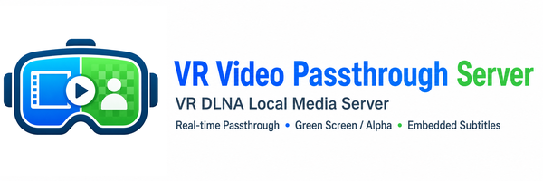

# VR Video Passthrough Server

English | [Chinese](README.zh-CN.md)

VR Video Passthrough Server is a Windows-first VR DLNA media server for local playback and desktop control. It is designed primarily for VR180 half-equirectangular video sources. It exposes a local video library over DLNA/UPnP and can serve realtime passthrough streams with either green-screen compositing or alpha passthrough output. It also supports realtime subtitle embedding in the passthrough stream. A PySide6 desktop UI is included for local management and offline generation workflows.



## Features

- DLNA discovery and ContentDirectory browsing
- Realtime passthrough streaming with GPU matting and HEVC output
- Realtime subtitle embedding in the passthrough stream
- Green-screen and alpha passthrough modes
- Offline passthrough video generation
- Multi-root local video library support
- PySide6 desktop UI with Chinese, English, and Japanese translations
- Subtitle preview and style configuration
- Aggressive VRAM-aware pipeline tuning aimed at keeping realtime output smooth, including 8K-class source playback targets where the hardware can sustain them

## Requirements

- Windows 10 / 11
- Python 3.12
- NVIDIA GPU for the realtime pipeline
- FFmpeg / FFprobe

## Quick Start

```bash
uv run python main.py
```

Launch the desktop UI:

```bash
uv run python -m ui.app
```

## Configuration Notes

- `PT_VIDEO_DIR` supports multiple roots separated by `|`
- `PT_PASSTHROUGH_OUTPUT_MODE` supports `none`, `green`, `alpha`, and `all`
- `Alpha Passthrough` is the DLNA virtual title used in alpha mode
- UI settings are stored separately from backend runtime configuration

## Project Layout

```text
main.py        Server entry point
config.py      Runtime configuration
dlna/          UPnP / DLNA discovery and catalog
http_app/      FastAPI routes
pipeline/      Decode, matting, encode, thumbnail, subtitle pipeline
offline/       Production offline conversion entry points
ui/            PySide6 desktop UI, pages, i18n, and process control
tools/         Developer probes and diagnostics
models/        Local model files and manifests
resources/     Packaged UI/runtime assets
prompt/        Handover notes and investigation reports
```

## Referenced Open Source Models

VR Video Passthrough Server does not train matting models itself. It consumes upstream models and model files from the projects below.

| Model | Role | Upstream |
| --- | --- | --- |
| Robust Video Matting (RVM) | Primary realtime matting path, including `rvm_mobilenetv3_fp32.onnx` and `rvm_resnet50_fp32.onnx` | [GitHub](https://github.com/PeterL1n/RobustVideoMatting) |
| MatAnyone2 | Slower, higher-quality matting path for offline conversion and experimental workflows | [GitHub](https://github.com/pq-yang/MatAnyone2) |
| Segment Anything Model 3 (SAM 3) | Optional helper used by experimental alpha tooling and prepass workflows | [GitHub](https://github.com/facebookresearch/sam3) |

## Referenced Dependencies

- [PySide6](https://www.qt.io/qt-for-python)
- [FastAPI](https://github.com/fastapi/fastapi)
- [Uvicorn](https://github.com/encode/uvicorn)
- [ONNX Runtime](https://github.com/microsoft/onnxruntime)
- [CuPy](https://github.com/cupy/cupy)
- [PyNvVideoCodec](https://github.com/NVIDIA/VideoProcessingFramework)

## Notes

- The codebase is currently tuned for a local Windows machine rather than a hosted deployment.
- Alpha passthrough is exposed as a virtual DLNA item named `Alpha Passthrough`.
- The current pipeline is tuned for VR180 half-equirectangular sources rather than generic 360-degree or flat video workflows.
- See [README.zh-CN.md](README.zh-CN.md) for the Chinese version.

## License

License: `AGPL-3.0-or-later`.

See the repository license for project terms. Upstream model repositories keep their own licenses and usage terms.
