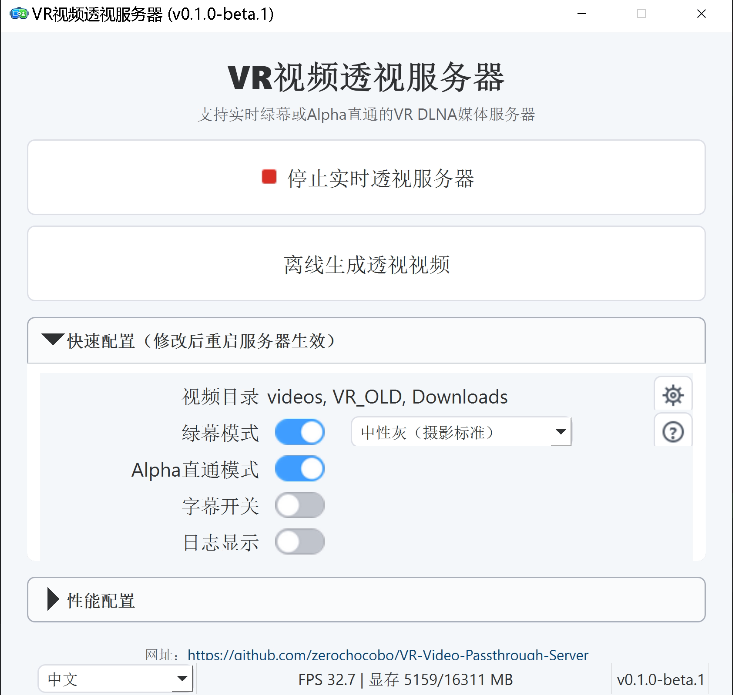

# VR视频透视服务器

中文 | [English](README.md) | [日本語](README.ja-JP.md)

项目官网：[https://wapok.com](https://wapok.com)

VR视频透视服务器 的目标是让所有VR视频都可以透视，实现混合现实(MR)。


它是以 Windows 为主要运行平台的 VR DLNA 本地媒体服务器，提供多语言桌面界面和独立离线工具。软件通过 DLNA/UPnP 暴露本地视频库，并提供实时绿幕透视、Alpha透视、2D视频透视、2D转3D / VR、NVIDIA RTX视频超分辨率、VR硬字幕、匹配环境光，以及基于同名 `.si.wav` sidecar 的配音/同传播放。软件主要针对 VR180 半等柱体投影（half-equirectangular）视频优化，同时支持符合条件的普通2D视频。

当前桌面版本：**v1.2.0**。

## 项目起源

本想做一个 VR 视频透视工具。  
有人说: 你这是重复造轮子。  
我说：那个多年前的旧轮子已经太老了，该换新的了。  
七天后，新轮子诞生了。  
这是属于 AI 时代的奇迹。  

## 功能

- DLNA 发现与 视频资源目录 浏览
- 基于 GPU 抠像和 HEVC 编码的实时透视串流
- 实时透视流内嵌字幕
- 绿幕模式与 Alpha 直通模式
- 离线透视视频生成
- 基于 DA3 深度和 GPU 立体渲染的实时与离线 2D 转 3D / VR
- 2D 转 3D 可选深度稳定，包括内置时域稳定和面向离线 16:9 任务的 NVDS ONNX 稳定
- 面向符合条件的2D与VR源视频的实时/离线 NVIDIA RTX视频超分，支持自适应“8K VR / 4K 2D”输出
- 2:1 SBS VR左右眼全GPU处理，离线4K VR转8K VR可输出8192x4096 HEVC
- RTX VSR目标质量提供低/中/高/超高，HDR观感提供关闭/自然/鲜明三档SDR画面处理
- 实时与离线美颜（正在开发测试，可在设置界面中开启）
- 实时与离线去马赛克（正在开发测试，可在设置界面中开启）
- 基于同名 `.si.wav` sidecar 的配音/同传播放，提供 `[SI]` DLNA入口、时间选择、声道混音和轻度/正常/强力压低原声
- DLNA Live 时间索引目录，可按 10 分钟分组、分钟目录和 5 秒播放点选择开始播放时间
- 支持多个本地视频根目录
- PySide6桌面UI，包含导航栏、功能卡片首页、离线工具、字幕样式、日志和设置页面
- 可编辑DLNA服务器名称和HTTP端口，支持中文、英文、日文
- 字幕预览与字幕样式配置
- 实时匹配环境光，可设置色温、色调、曝光、对比度、Gamma、饱和度和预设
- 面向8K级源视频的显存与吞吐优化，在硬件可承受范围内尽量维持目标输出帧率


|  |


## 透视视频效果图

| Alpha Passthrough | 绿幕 Passthrough |
| --- | --- |
|  |  |
|  |

## 运行要求

- Windows 10 / 11
- Python 3.12
- NVIDIA GPU，用于GPU处理链路。粗略建议使用RTX 20系列及以上；RTX VSR还要求显卡和驱动支持NVIDIA RTX Video。具体型号请查询NVIDIA官方列表：<https://developer.nvidia.com/cuda/gpus>。推荐显存：实时服务器、RVM离线生成和普通DA3 2D转3D建议6 GB以上，MatAnyone2 / SAM3离线流程建议约15 GB以上。HD/Large DA3、NVDS和8K超分属于高负载离线流程。
- FFmpeg / FFprobe

性能提示：4K SBS VR以超高质量转换到8K VR对GPU要求极高，RTX 5060 Ti实测处理速度约23–24 FPS。低端显卡建议降低“目标质量”，或在全局设置中降低“输出FPS”；NVENC P1只控制编码速度，与NGX目标质量不同。

## 快速启动

```bash
uv run python main.py
```

启动桌面 UI：

```bash
uv run python -m ui.app
```

## 端口与防火墙

软件启动实时服务器时会占用以下网络端口：

| 用途 | 协议 / 端口 | 说明 |
| --- | --- | --- |
| HTTP 媒体服务 | TCP 8200 | 提供 DLNA 设备描述、媒体目录、缩略图、原始视频和实时透视视频流。可通过环境变量 `PT_HTTP_PORT` 修改。 |
| SSDP / UPnP 发现 | UDP 1900 | 用于让 VR 播放器在局域网内发现本机 DLNA 服务器。 |
| 启动状态 | TCP 8299（仅本机） | UI 启动过程中读取 GPU warmup / 启动状态使用。默认只给本机 UI 使用，可通过 `PT_STARTUP_STATUS_PORT` 修改。 |

首次启动时，程序会尝试自动添加 Windows 防火墙入站规则：

- `PTServer HTTP Private`：允许专用网络上的 TCP 8200 入站。
- `PTServer SSDP Private`：允许专用网络上的 UDP 1900 入站。

如果 Windows 弹出 UAC / 防火墙确认窗口，请选择允许。建议只允许“专用网络”，不要暴露到公用网络。

如果误点了拒绝，或播放器无法发现服务器，可以手动添加规则。以管理员身份打开 PowerShell 或命令提示符，执行：

```powershell
netsh advfirewall firewall add rule name="PTServer HTTP Private" dir=in action=allow protocol=TCP localport=8200 profile=private edge=no enable=yes
netsh advfirewall firewall add rule name="PTServer SSDP Private" dir=in action=allow protocol=UDP localport=1900 profile=private edge=no enable=yes
```

如果你修改了 `PT_HTTP_PORT`，请把第一条命令中的 `8200` 换成实际端口。UDP 1900 是 UPnP/SSDP 标准发现端口，通常不需要修改。

也可以通过 Windows 图形界面设置：

1. 打开“Windows 安全中心” -> “防火墙和网络保护” -> “高级设置”。
2. 进入“入站规则”，新建规则。
3. 规则类型选择“端口”。
4. 分别添加 `TCP 8200` 和 `UDP 1900`。
5. 操作选择“允许连接”。
6. 配置文件建议只勾选“专用”。
7. 名称可填写 `PTServer HTTP Private` 和 `PTServer SSDP Private`。

## 支持的 VR 视频播放器

基于 Meta Quest 3 设备测试。

| 播放器 | Alpha 直通 | 灰色绿幕 | ChromaKey 绿幕 | 网站 | 备注 |
| --- | --- | --- | --- | --- | --- |
| Skybox VR Player 2.0.2 Preview | 支持 | - | 支持 | [官网](https://skybox.xyz) | [安装说明](https://forum.skybox.xyz/d/2920-skybox-quest-v202-preview-performance-improvements) |
| Moon Player | - | 支持 | 支持 | [官网](https://moonvrplayer.com) | - |
| 4XVR Video Player | 支持 | - | 支持 | [官网](https://www.4xvr.net/) | - |
| DeoVR player | 支持 | - | 支持 | [官网](https://deovr.com/) | - |
| HereSphere VR Video Player | 支持 | - | 支持 | [官网](https://heresphere.com/) | - |

## 配置说明

- `PT_VIDEO_DIR` 支持用 `|` 分隔的多个目录
- 媒体根目录必须是本地路径。支持映射成本地盘符/目录的云盘，不支持UNC网络共享根路径。
- `PT_PASSTHROUGH_OUTPUT_MODE` 支持 `none`、`green`、`alpha`、`two_dvr`、`superres`，也支持 `green,alpha,two_dvr,superres` 这类逗号分隔组合；旧的 `all` 表示 green + alpha
- Alpha 模式下虚拟条目标题为 `Alpha Passthrough`
- 实时 2D 转 3D 使用 `PT_TWO_DVR_MODEL`、`PT_TWO_DVR_STRENGTH` 和相关 `PT_TWO_DVR_*` 设置；离线 2D 转 3D / VR 在桌面 UI 中提供模型、画质速度、时域稳定和“目标文件存在则跳过”等控制。
- 实时超分使用 `PT_RTX_VSR_TARGET_HEIGHT`、`PT_RTX_VSR_QUALITY` 和 `PT_RTX_VSR_HDR_LOOK`。自适应4096目标对识别出的2:1 SBS VR输出8192x4096，对普通2D输出3840x2160。
- 同名 `.si.wav` 文件会启用 `[SI]` DLNA入口。当前DLNA播放通过 `/si_live` 实时输出MPEG-TS并支持起播偏移；旧的渐进式 `/media_si` 保留为后备路由。
- DLNA Live目录会按功能显示 `[GREEN]`、`[ALPHA]`、`[2D>3D]`、`[SuperRes]` 和 `[SI]` 标记，并提供本地化的 `[选择时间索引]` 目录。
- 桌面设置页可修改DLNA服务器名称和HTTP端口；保存网络身份配置后需要重启服务器。
- Windows发布包已包含验证过的CUDA 12.6 RTX VSR bridge、NGX运行库、本地CUDA runtime、许可证和版本信息，终端用户不需要自行编译bridge。
- TensorRT 加速在桌面 UI 的“性能配置”中控制。请先进入 `TensorRT -> 配置` 构建缓存；首次构建可能需要数分钟。如果驱动、CUDA、TensorRT 或模型变化导致缓存缺失/过期，服务器会自动回退到 CUDA。
- UI 配置与后台运行配置分离保存

## 网盘整合包

 [【夸克网盘】](https://pan.quark.cn/s/573eb1709e18?pwd=T3bS)
 [【百度网盘】](https://pan.baidu.com/s/1uHFVFjKwlaXVxrYQ0_qcnQ?pwd=1234)


## 项目结构

```text
main.py        服务入口
config.py      运行时配置
dlna/          UPnP / DLNA 发现与目录
http_app/      FastAPI 路由
pipeline/      解码、抠像、编码、缩略图、字幕流水线
offline/       生产用离线转换入口
ui/            PySide6 桌面 UI、页面、国际化与进程控制
tools/         开发探针和诊断工具
models/        本地模型文件与清单
resources/     打包用 UI / 运行时资源
prompt/        交接记录与调研文档
```

## 引用的开源模型

VR视频透视服务器 本身不训练抠像模型，只使用下列上游项目提供的模型与模型文件。

| 模型 | 用途 | 上游链接 |
| --- | --- | --- |
| Robust Video Matting (RVM) | 实时主抠像路径，包括 `rvm_mobilenetv3_fp32.onnx` 和 `rvm_resnet50_fp32.onnx` | [GitHub](https://github.com/PeterL1n/RobustVideoMatting) |
| MatAnyone2 | 离线转换与实验流程中使用的更慢但通常更高质量的抠像路径 | [GitHub](https://github.com/pq-yang/MatAnyone2) |
| Segment Anything Model 3 (SAM 3) | 用于高质量离线Alpha预处理流程的可选辅助分割模型 | [GitHub](https://github.com/facebookresearch/sam3) |
| Depth Anything 3 (DA3) | 实时与离线 2D 转 3D / VR 使用的单目深度模型 | [GitHub](https://github.com/ByteDance-Seed/Depth-Anything-3) |
| NVDS | 面向 16:9 源的离线 2D 转 3D 深度 / near-map 时域稳定器 | [GitHub](https://github.com/RaymondWang987/NVDS) |

## 引用的依赖

- [PySide6](https://www.qt.io/qt-for-python)
- [FastAPI](https://github.com/fastapi/fastapi)
- [Uvicorn](https://github.com/encode/uvicorn)
- [ONNX Runtime](https://github.com/microsoft/onnxruntime)
- [CuPy](https://github.com/cupy/cupy)
- [PyNvVideoCodec](https://github.com/NVIDIA/VideoProcessingFramework)
- [PyAV](https://github.com/PyAV-Org/PyAV)
- [NVIDIA RTX Video SDK](https://developer.nvidia.com/rtx-video-sdk)

## 说明

- 本项目当前主要面向本地 Windows 机器运行，而不是作为托管服务部署。
- 各生成模式以独立DLNA条目按需处理，原始媒体保持不变并继续可播放。
- 当前处理链路主要针对VR180半等柱体投影视频优化，同时支持部分普通2D视频流程。
- 英文版请见 [README.md](README.md)，日文版请见 [README.ja-JP.md](README.ja-JP.md)。

## 许可

许可：`AGPL-3.0-or-later`。


项目许可见仓库根目录的许可证文件。上游模型仓库各自保留自己的许可与使用条款。
